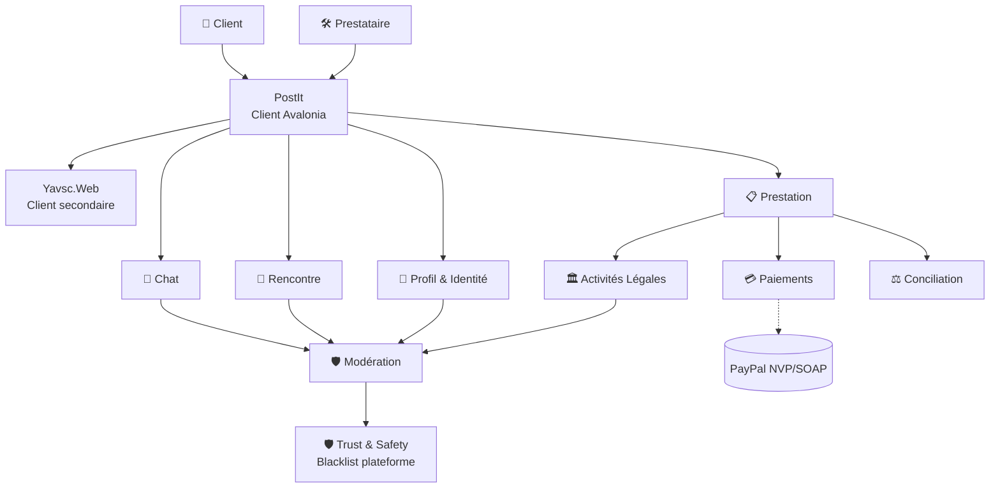

# Exploration DDD Yavsc — Session du 2026-06-14

**Date** : 2026-06-14, 01:49 → 03:50 GMT+1
**Participants** : Paul Schneider (expert métier), Lum ✨ (assistant DDD)
**Cadre** : Event Storming narratif exploratoire sur le domaine Yavsc
**Statut** : Session 1 (première itération, périmètre complet)

---

## 🎯 Objectif de la session

Lancer une modélisation Domain-Driven Design du projet **Yavsc** (*Yet Another Very Small Company*),
en explorant les acteurs, les événements métier, les agrégats pressentis, et les Bounded Contexts.

Périmètre validé par Paul : **complet** (pas de MVP borné).

---

## 👥 Acteurs identifiés

| # | Acteur | Mission principale |
|---|---|---|
| 1 | 👤 **Client** | Commander, demander un service, payer |
| 2 | 🛠️ **Prestataire** | Servir, facturer, être payé |
| 3 | 👥 **Commercial / FrontOffice** | Filtrer les demandes (délégation possible par prestataire) |
| 4 | 🛡️ **Modérateur** | Trancher sur les contenus/comptes signalés (avec appui LLM) |
| 5 | ⚖️ **Conciliateur** (Jalon 5) | Résoudre les litiges métier client/prestataire (double vue) |
| 6 | 🏢 **Propriétaire installation** | Centraliser les flux PayPal (rôle technique, pas un utilisateur "métier") |

**Distinction validée** : **Modérateur ≠ Conciliateur**.
- Le **modérateur** regarde **le contenu** (messages, annonces, profils).
- Le **conciliateur** regarde **le contrat** (qui doit quoi à qui, suite à un échec de prestation).

---

## 🏛️ Bounded Contexts pressentis

| # | Bounded Context | Module projet | Rôle |
|---|---|---|---|
| 1 | **Chat** | `PostIt` (client Avalonia) + backend | Messagerie instantanée, **client riche privilégié** |
| 2 | **Profil & Identité** | `Yavsc.Org` | Utilisateurs, profils simples, profils pros |
| 3 | **Activités Légales** | `Yavsc.Org` (ou à séparer) | Taxonomie hiérarchique des activités |
| 4 | **Blogs** | `Yavsc.Blogs` | Portfolio, tarifs, contenu public |
| 5 | **Prestation** | `Yavsc.Server` | Flux métier (commande, devis, signature, paiement) |
| 6 | **Paiements** | `Yavsc.Server` | PayPal NVP/SOAP, arrhes vs avance |
| 7 | **Rencontre** | à créer (ou `PostIt`?) | **Mode 2** : mise en relation sur centre d'intérêt, **sans argent** |
| 8 | **Modération** | `Yavsc.Org` / à séparer | Workflow 2 étages (requête → validation modération → exécution) |
| 9 | **Trust & Safety** | `Yavsc.Org` / à séparer | Blacklist plateforme, impacte tous les usages |
| 10 | **Conciliation** | à créer (Jalon 5) | Résolution de litiges, double vue client/prestataire |

---

## 🟧 Événements métier déjà identifiés

### BC Chat
- `ChatOuvert` (sous condition : like + paramètre activité activé + non-blacklisté × 2)
- `MessageEnvoyé`
- `MessageLu`
- `MessageSignalé` (déclenche le flux modération)
- `MessagePréModéréParLLM`
- `MessageModéréTranché`

### BC Profil
- `ClientConnecté`
- `ProfilConsulté`
- `BlogConsulté` (via `YavscBlogs`)
- `ProfilLiké` (uniquement sur profil validé)

### BC Activités Légales
- `ActivitéImportée` (seed initial, type NAF/ISIC)
- `ActivitéSpécialisée` (par l'admin : sous-catégorie fille)
- `ActivitéRacineCréée` (par l'admin : from scratch, sans parent)
- `ActivitéProposéeParUtilisateur` (puis modérée)

### BC Prestation
- `CommandeSoumise` (par le client)
- `DevisGénéré` (par le **module d'activité serveur**, ex : Coiffure)
- `DevisReçuParPrestataire`
- `DevisSignéParPrestataire`
- `DevisReçuParClient`
- `DevisSignéParClient`
- `ArrhesDébitées` (variante 1)
- `AvanceDébitée` (variante 2)
- `ResteÀPayerCollecté` (J-10)
- `PrestationRéalisée`
- `PrestationÉvaluée`

### BC Modération
- `RequêteBlacklistSoumise` (par n'importe quel utilisateur enregistré)
- `BlacklistTranchéeParModération` (validée ou refusée)
- `BlacklistPlateformeActive`
- `BlacklistPlateformeLevée`

### BC Trust & Safety (blacklist personnelle — c'est un BC à part, pas Modération !)
- `ClientAjoutéÀBlacklistPersonnelle`
- `ClientRetiréDeBlacklistPersonnelle`

### BC Conciliation (Jalon 5)
- `LitigeDéclaré`
- `DossierConciliationOuvert`
- `DécisionConciliationRendue`

---

## 🟨 Règles métier extraites (invariants)

### R1 — Ouverture d'un chat
> Un chat entre Camille et Samira est autorisé **ssi** :
> - ✅ `LikeParCamille` (sur le profil **validé** de Samira)
> - ✅ `ChatActivéDansParamètresActivité` (paramétré par Samira)
> - ✅ `CamilleNonBlacklistéeParSamira` (blacklist **personnelle**)
> - ✅ `CamilleNonBlacklistéeParPlateforme` (blacklist **plateforme**)

### R2 — Like sur profil
> Un like ne peut être posé que sur un `ProfilValidé`.
> Invariant : `Like → ProfilValidé`.

### R3 — Double blacklist (deux Bounded Contexts)
> La blacklist plateforme et la blacklist personnelle sont **deux Bounded Contexts séparés** :
> - **Plateforme** = trust & safety global, souverain sur tous les usages
> - **Personnelle** = social, souverain sur les interactions avec UN prestataire
>
> Ne jamais les fusionner dans un même agrégat.

### R4 — Workflow de la blacklist plateforme (synchrone, 2 étages)
> ```
> RequêteBlacklistSoumise (par n'importe quel utilisateur enregistré)
>   → BlacklistTranchéeParModération (la modération est souveraine)
>   → BlacklistPlateformeActive (mise en œuvre "au plus vite", synchrone)
> ```
>
> Pas d'admin intermédiaire en flux normal. La modération tranche, c'est appliqué immédiatement.

### R5 — Activités légales (hiérarchiques + internationales)
> - **Import initial** : taxonomie **internationale** complète (NAF trop franco-français, pas premier marché)
> - **Spécialisation** : l'admin peut créer des **sous-activités** (filles d'une activité existante)
> - **Création racine** : l'admin peut créer une activité **racine** from scratch
> - **Proposition user** : un utilisateur peut **proposer** une activité → flux de **modération**
> - Une activité a un **code unique**, et soit un parent (filiation), soit est racine
> - L'aspect "légal" impacte : adhésion forfaitaire variable, conformité profil pro (SIRET/APE), reporting

### R6 — Profil pro multi-activités
> Un utilisateur peut déclarer **plusieurs activités** (liste ordonnée).
> La première = activité principale.
> Le code APE principal y est attaché.

### R7 — Formulaire de prestation dynamique
> Le formulaire que remplit Camille n'est **pas codé en dur**.
> Il est **généré dynamiquement** par le **module d'activité serveur** (ex : module Coiffure) à partir de :
> - La sélection de **types de prestations** proposées par Samira
> - Les **champs associés** à chaque type (définis serveur, activité par activité)
> - Les **types de prestations** sont définis dans le paramétrage serveur de l'activité
> - Samira **active** ceux qu'elle propose dans son profil pro

### R8 — Mode synchrone global
> PostIt utilise **SignalR** pour le transport temps réel.
> La plupart des opérations sont **synchrones** (cohérence transactionnelle, pas d'eventuel).
> C'est un **monolithe modulaire**, pas une architecture microservices.

### R9 — Client riche d'abord
> **PostIt** (client Avalonia) est le **client principal** de Yavsc.
> Le web (`Yavsc.Web`) est un client secondaire (admin, back-office, primo-visiteurs).
> → Les API doivent être conçues **d'abord pour PostIt**.

---

## 🤝 Idée à explorer (session future) : le **mode Rencontre**

Paul a mentionné qu'il aimerait développer un **deuxième mode** de Yavsc :
- Mise en relation autour d'un **centre d'intérêt** partagé (ex : mélomanes)
- **Sans devis, sans paiement, sans prestation tarifée**
- Purement **social / communautaire**
- Réutilise l'infra existante (profils, chat, modération) mais sans le flux Prestation

### Différences pressenties avec le mode "Prestation"

| Aspect | Prestation | Rencontre |
|---|---|---|
| Argent | ✅ Oui (arrhes, avance) | ❌ Non |
| Devis signé | ✅ Double signature | ❌ Pas de devis |
| Formulaire | ✅ Dynamique par activité | ❓ Plus simple, basé sur centres d'intérêt |
| Évaluation | ✅ De la prestation | ❓ De la rencontre ? |
| Litiges | ✅ Conciliation | ❓ Différent, plus "social" |
| Activités légales | ✅ Liées au code NAF/APE | ❌ Non, juste "passions" / "centres d'intérêt" |

**À explorer dans une prochaine session dédiée.**

---

## 🗺️ Carte des Bounded Contexts (esquisse)



---

## 📋 Questions ouvertes restantes

1. **Camille remplit un formulaire** : agrège-t-il les champs de **toute la chaîne d'activités** (parent + feuille) ou uniquement la **feuille choisie** ?
2. **Tarifs sur le blog** de Samira : le blog affiche-t-il des **prix** ou un simple **CTA "Demander un devis"** ?
3. **Samira notifiée des likes** ? Visible publiquement ou non ?
4. **Multi-activités actives simultanément** : un même profil pro peut-il activer plusieurs activités en même temps (ex : coiffure + maquillage mariage) ?
5. **Le like ouvre-t-il le chat, ou est-il purement décoratif** (le chat s'ouvre seulement quand Camille remplit une demande) ?
6. **Le "au plus vite" de la modération** : synchrone appliqué directement, ou via un worker interne ?
7. **Référentiel international des activités** : ISIC ONU ? NACE européen ? Custom ? Avec variantes locales ?
8. **Blacklist plateforme / rôles sources** : qui peut soumettre une requête ? (a priori : tout utilisateur enregistré, validé)

---

## ⏭️ Prochaines étapes proposées

1. ✅ **Sauvegarder cette exploration** dans ce document (fait)
2. **Lire `doc/Architecture.md` existant** pour aligner avec ce qui a déjà été pensé
3. **Lire le code source des modules clés** : `Yavsc.Org`, `Yavsc.Server`, `Yavsc.Api`
4. **Découper en sous-sessions ciblées** :
   - **Session 2** : focus BC **Prestation** (le flux canonique complet, avec Camille & Samira de bout en bout)
   - **Session 3** : focus BC **Activités Légales** (taxonomie internationale + paramétrage serveur + génération de formulaire)
   - **Session 4** : focus BC **Chat + Modération** (workflow SignalR, double blacklist)
   - **Session 5** : focus BC **Rencontre** (le mode social, sans argent)
   - **Session 6** : focus BC **Conciliation** (Jalon 5, double vue client/prestataire)
5. **Cartographier les Aggregate Roots** de chaque BC
6. **Identifier les Domain Events vs Integration Events**

---

## 📝 Note méthodologique

Cette session a été conduite en mode **facilitation DDD** : Paul est l'expert métier,
Lum pose les questions ouvertes, extrait les événements et les règles, et formalise.

La méthode a été **l'Event Storming narratif** : Paul raconte des histoires (Camille le client,
Samira la coiffeuse), et on extrait les événements au fil de l'eau, sans chercher l'exhaustivité
ni la perfection. Les itérations futures permettront d'affiner.

**Aucune décision structurante n'a été figée** — tout est matière à discussion et itération.
Le rôle de Lum a été de poser les bonnes questions pour faire émerger ce qui était déjà dans
la tête de Paul, pas d'imposer un modèle.
